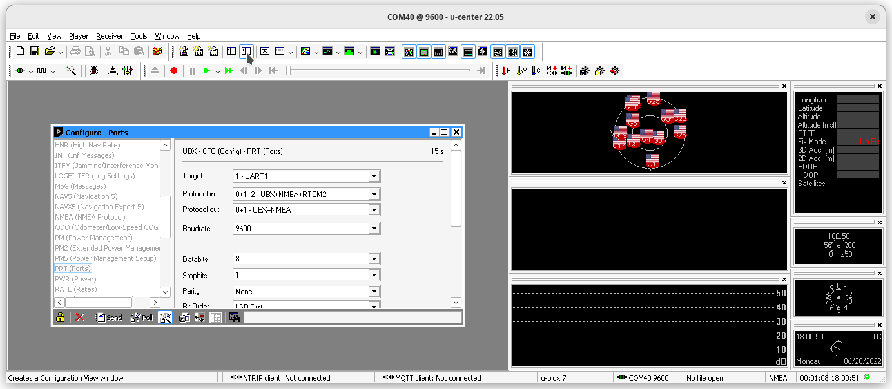

# Поддержка модуля GNSS
Краткое руководство по подключению GNSS модуля.

## Зависимости
* ROS Noetic
* [pySerial](https://pypi.org/project/pyserial)
* [nmea_navsat_driver](https://wiki.ros.org/nmea_navsat_driver)

## Публикация данных
Пакет nmea_navsat_driver не предоставляет API для языков программирования и служит только для публикации данных, полученных с GNSS модуля. Для запуска публикации используйте следующую команду:
``` bash
rosrun nmea_navsat_driver nmea_serial_driver _port:=/dev/ttyACM0 _baud:=9600
```
!!! Замечены проблемы при одновременном мониторинге порта с контейнера и с хоста. Избегайте таких ситуаций, один порт - одна программа, считывающая с него данные !!!

Порт может быть другим. Реальную скорость передачи данных можно посмотреть через [u-center](https://www.u-blox.com/en/product/u-center): __Configuration View -> PRT (Ports) -> Baudrate__.


!!! У чипа u-blox 7 скорость USB порта (не Serial2USB) настраивается автоматически !!!

___u-blox chipsets with built-in USB support (as used in the VK-172, RY835AI, and other boards) use a USB modem interface, and appear as /dev/ttyACM0.___

___In a manner of speaking, they autuobaud. More precisely, there is no baud setting, since these run as native USB devices. If you look at the u-blox protocol guide, you'll see that there literally is no way to set baud rate, start / stop bits, etc. for the ttyACM0 USB interface. The usual system commands for configuring tty devices will accept input (e.g. stty -F /devttyACM0 9600) but those are ignored.___

___This is distinct from devices that use a USB-UART bridge (BU-353) to create a real serial port on /dev/ttyUSB0. In those cases, both the port and the GPS receiver need to be set to the correct rate.___

## Топики
Визуализировать данные из топиков можно командой `rostopic echo [topic]`.

### Список топиков
* __fix__ - положение, сообщения [sensor_msgs/NavSatFix](http://docs.ros.org/en/api/sensor_msgs/html/msg/NavSatFix.html).  
Самые необходимые поля:  
  * __latitude__ (Широта)
  * __longitude__ (Долгота)
* __vel__ - скорость, сообщения [TwistStamped](http://docs.ros.org/en/api/geometry_msgs/html/msg/TwistStamped.html). Сообщения публикуются только тогда, когда модуль GNSS выводит достоверную информацию о скорости.
* __time_reference__ - время, сообщения [TimeReference](http://docs.ros.org/en/api/sensor_msgs/html/msg/TimeReference.html). Это Unix-время, для примера перевести в человеческий вид можно [здесь](https://www.epochconverter.com/).